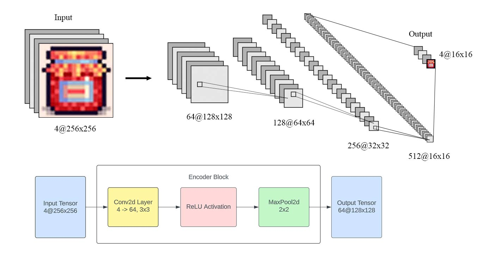

<h1>PixelArtCNN: Convolutional neural network for sprite restoration.</h1>

This project aims to restore distorted pixel art images to a pixel-perfect state. Pixel art, a distinctive form of digital art known for its clean lines, distinct color blocks, and simple color palettes, frequently encounters issues such as distortion caused by JPEG compression, multiple iterations of upscaling, and other transformations that occur during the distribution of these images on the internet. The transparency mask is also usually lost after distribution. Additionally, text-to-image diffusion models such as Midjourney and Stable Diffusion were trained on these images, therefore their outputs contain similar distortions.
 
 
Conventional image processing methods often struggle to precisely restore the distinct characteristics of pixel art. The diverse range of distortions in source images, combined with the relatively constrained robustness of these techniques, imposes limits on their performance for this task. By leveraging a convolutional neural network and a custom loss function that penalizes edge blurriness, PixelArtCNN can restore the transparency mask, the distinct color palettes, and the sharply defined boundaries that define the pixel art style.
 
 
The initial training dataset was comprised of 1,074 pixel-perfect 16x16x4 item sprites sourced from platforms like GameDev Market and itch.io. Prior to training, a pre-processing phase introduced synthetic distortions, such as JPEG compression artifacts, a random-color perlin noise background, sub-pixel offset, and lossy upscaling. These synthetic distortions were designed to approximate the distortions typically observed in real-world pixel art images from sources such as Google Images, Imgur, and image datasets such as LAION-5B. During training, the distorted images were used as input data, while the original pixel-perfect images were used as labels.

<h3>Model Architecture</h3>

The encoder-only architecture applies convolutional operations, ReLU activation, and max-pooling to progressively reduce the resolution of the input image from 256x256 to 16x16. The system operates as a CNN-based downscaler, where the objective is to simultaneously enhance feature representation by expanding the number of channels within the convolutional layers, while decreasing resolution through max-pooling operations. The increasing channel count in the forward pass facilitates the preservation of pixel-level information despite the reduction in image dimensions.
 
 

 
Each convolutional block reduces the resolution of the input by a factor of 2 in both spatial dimensions. This downsampling is achieved through the use of max pooling, which selects the maximum value within a sliding window and discards the rest.
 
 
In the final block, a 1x1 convolution layer is used to transition from 512 feature channels down to 4 channels, mapping the feature representations into the desired RGBA channel configuration while preserving spatial resolution.
 
 
A sigmoid activation function is then applied to normalize the output values to the [0,1] range.

<h3>Usage</h3>

usage goes here